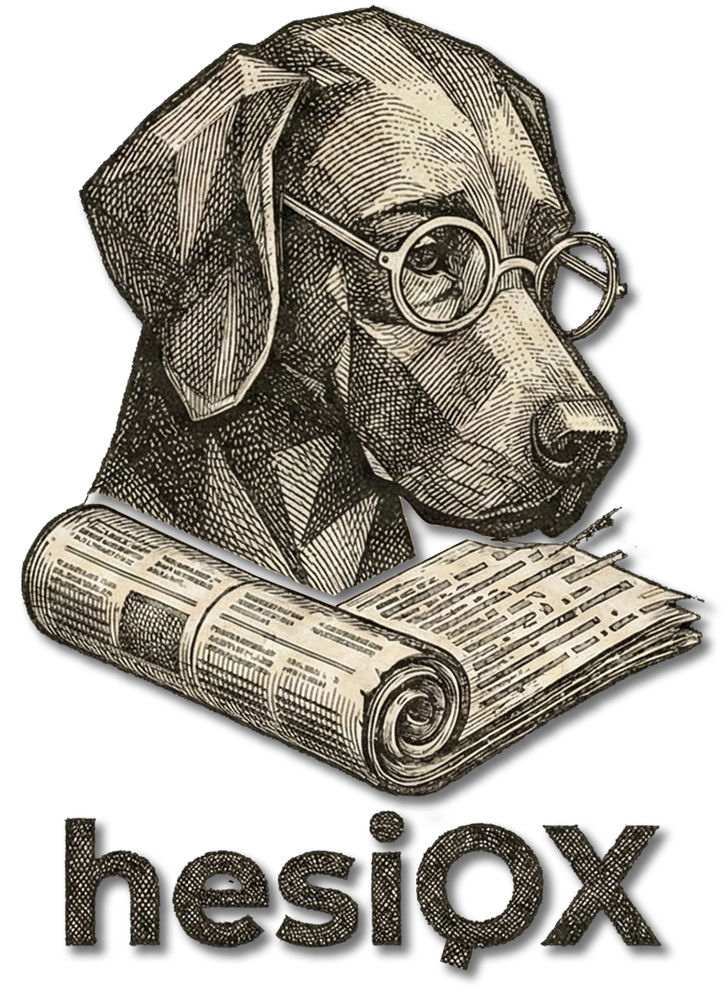

# hesiOX - Sistema de Gestión Hemerográfica y Análisis Lab (v4.2.0)

**hesiOX** is a comprehensive methodology and software laboratory designed for the conversion of documentary assets into structured, interoperable knowledge. It represents the convergence between **Archival Science**, **Data Engineering**, and **Digital Humanities**.

Originally developed for the academic study of historical press (Project S.S. Sirio), hesiOX has evolved into a multi-purpose tool for managing and analyzing complex document corpora.

## 🚀 Key Features

### 📂 Academic Corpus Management
- **Multi-project Support**: Manage independent research projects (theses, articles, books) with their own reference libraries.
- **Academic Export**: Export references in BibTeX, RIS, Chicago, APA, MLA, and Vancouver formats.
- **Interoperability**: Compatible with Zotero, Mendeley, and EndNote.

### 🤖 Artificial Intelligence & NLP
- **Intelligent Knowledge Networks**: Automatic Detection of Entities (People, Places, Organizations) using **spaCy NER**.
- **Corpus CHAT (RAG)**: Multimodal natural language interaction with your documents with full traceability to primary sources.
- **Semantic Search**: NLP-powered engine that understands the context of your queries.

### 🗺️ Geospatial Analysis (GIS)
- **Old Map Georeferencing**: Vectorize and digitalize historical maps as Geographic Information Systems.
- **Spatial Patterns**: Visualize the geographical evolution of documentary sources.
- **Geosemantic Analysis**: Calculation of geodesics (Haversine) and GeoJSON export.

### 🎭 Theatrical Discourse Processing (NEW)
- **Drama Analysis**: Study of co-presence, character networks, and emotional trajectories.
- **Sentiment Analysis**: Visualization of the emotional flow throughout theatrical works.

### 🔍 Digitization & Forensics
- **Smart OCR**: Automatic text extraction from historical press images using **Tesseract.js**.
- **Monte Carlo Navigation**: Random trajectory execution and forensic analysis of historical drift using AI.

## 🛠️ Technology Stack

- **Backend**: Python Flask
- **Database**: PostgreSQL (SQLAlchemy)
- **Frontend**: Bootstrap 5, D3.js, Chart.js, Leaflet Maps, Choices.js
- **Artificial Intelligence**: spaCy (NLP), OpenAI/Gemini/Anthropic API integration for RAG.
- **OCR**: Tesseract.js

## 📄 License

**100% Free Software** - Licensed under **GPL v3**. Open source and extensible for the academic community.

---
Developed for the **LINHD-UNED** and the Digital Humanities community.
