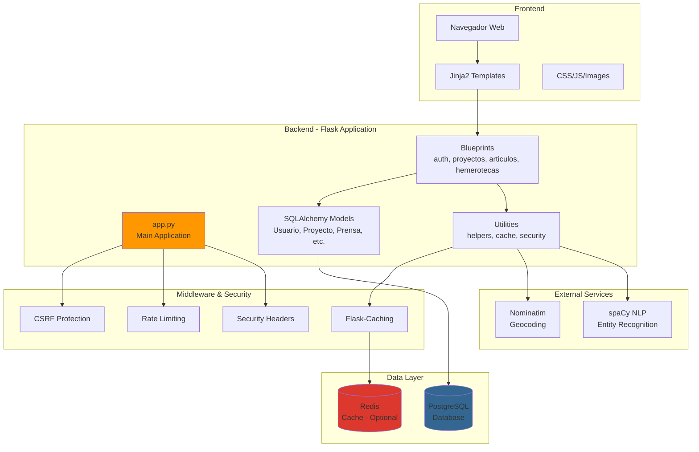
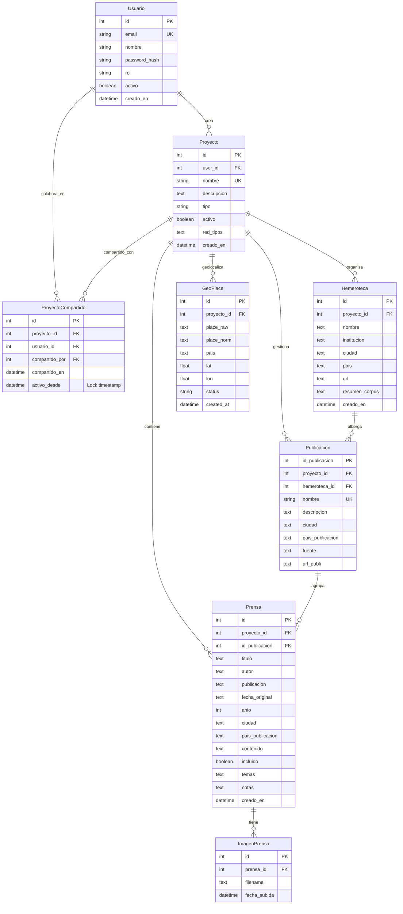
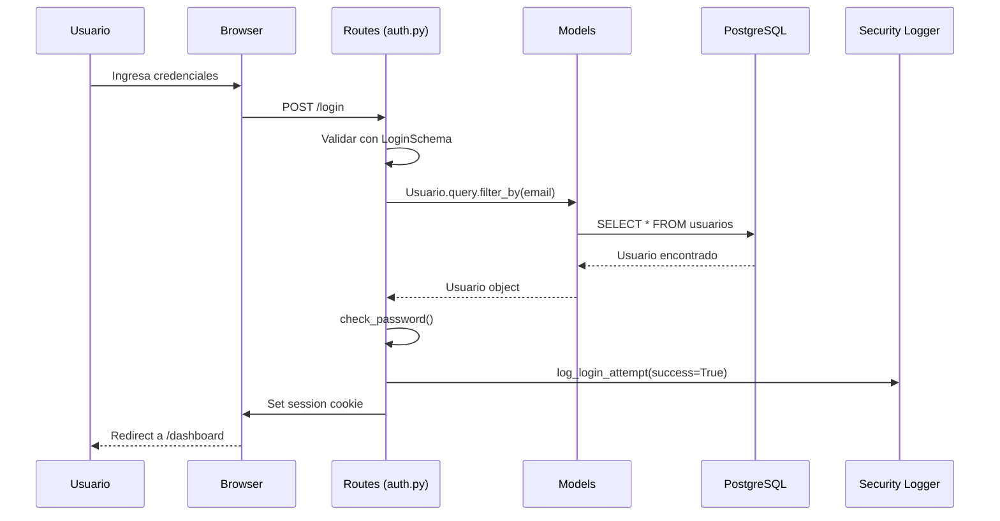
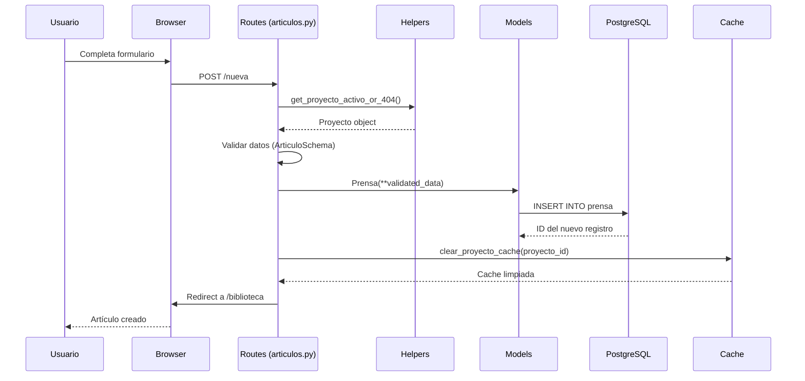
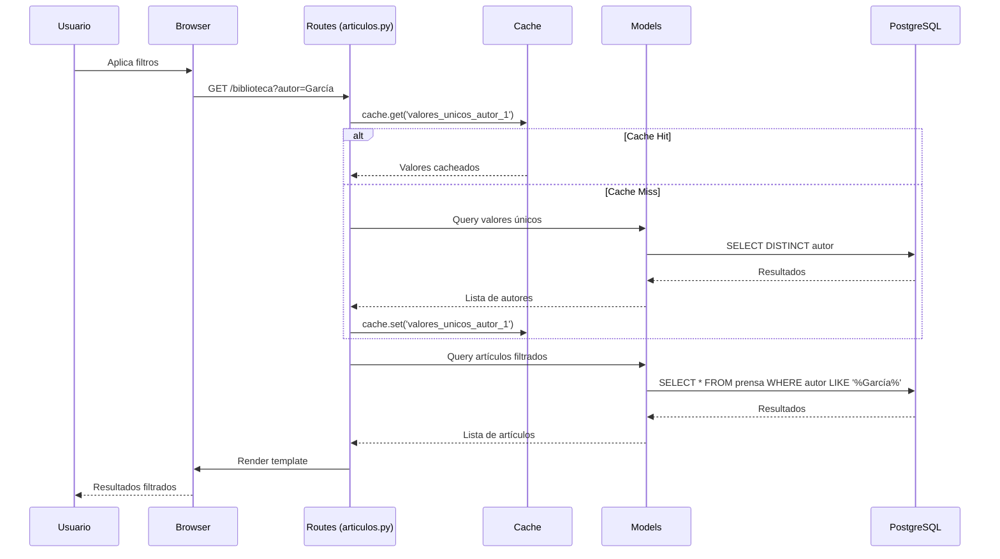
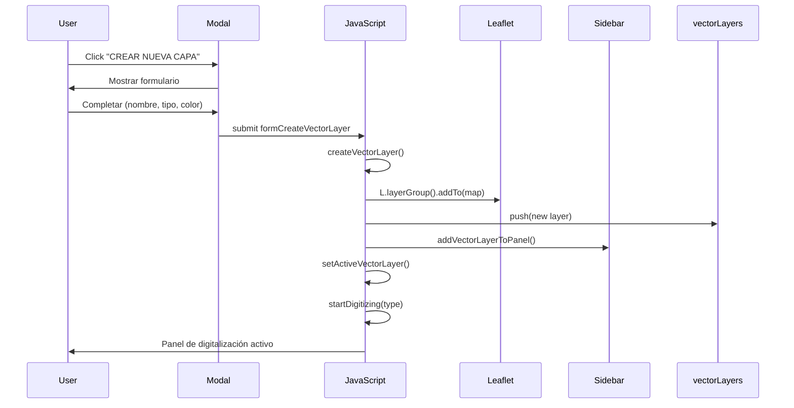

# Arquitectura de hesiOX

## Visión General

hesiOX es una aplicación web Flask para gestión de referencias bibliográficas con enfoque en hemerografía histórica.

---

## Diagrama de Arquitectura



---

## Diagrama de Base de Datos (ER)



---

## Flujo de Datos

### 1. Autenticación de Usuario



### 2. Creación de Artículo



### 3. Búsqueda con Filtros



---

## Estructura de Directorios

```
hesiox_bibliografia/
├── app.py                      # Aplicación principal Flask
├── models.py                   # Modelos SQLAlchemy
├── extensions.py               # Extensiones compartidas (db)
├── utils.py                    # Utilidades generales
├── cache_config.py             # Configuración de caché
├── security_headers.py         # Headers de seguridad HTTP
├── security_logger.py          # Sistema de logging de seguridad
├── limiter.py                  # Configuración de rate limiting
├── schemas.py                  # Schemas Marshmallow para validación
├── requirements.txt            # Dependencias Python
├── .env                        # Variables de entorno (no en Git)
├── .gitignore                  # Archivos excluidos de Git
│
├── routes/                     # Blueprints modulares
│   ├── __init__.py
│   ├── auth.py                 # Autenticación (login, registro)
│   ├── proyectos.py            # Gestión de proyectos
│   ├── articulos.py            # CRUD de artículos
│   ├── articulos_helpers.py    # Helpers específicos de artículos
│   ├── hemerotecas.py          # Gestión de hemerotecas
│   └── helpers.py              # Helpers reutilizables
│
├── templates/                  # Plantillas Jinja2
│   ├── base.html               # Template base
│   ├── base_desktop.html       # Template para app desktop
│   ├── home.html               # Página de inicio
│   ├── login.html              # Login
│   ├── registro.html           # Registro
│   ├── dashboard.html          # Dashboard del usuario
│   ├── proyectos.html          # Listado de proyectos
│   ├── list.html               # Listado de artículos
│   ├── new.html                # Crear artículo
│   ├── editar.html             # Editar artículo
│   ├── hemerotecas.html        # Listado de hemerotecas
│   ├── publicaciones.html      # Listado de publicaciones
│   ├── estadisticas.html       # Estadísticas y gráficos
│   ├── mapa.html               # Mapa geográfico
│   ├── redes.html              # Análisis de redes
│   ├── timeline.html           # Timeline cronológico
│   └── errors/                 # Páginas de error personalizadas
│       ├── 400.html
│       ├── 403.html
│       ├── 404.html
│       ├── 429.html
│       └── 500.html
│
├── static/                     # Archivos estáticos
│   ├── css/
│   │   ├── app.css             # CSS principal (orquestador)
│   │   ├── web.css             # CSS para página pública
│   │   └── modules/            # Módulos CSS temáticos
│   │       ├── 01-variables.css
│   │       ├── 02-base.css
│   │       ├── 03-layout.css
│   │       ├── 04-buttons.css
│   │       ├── 05-forms.css
│   │       ├── 06-tables.css
│   │       ├── 07-cards.css
│   │       ├── 08-modals.css
│   │       ├── 10-filters.css
│   │       └── 16-responsive.css
│   ├── js/
│   │   ├── tabla.js            # Funcionalidad de tablas
│   │   ├── validar_formulario.js
│   │   └── analisis.js
│   ├── img/
│   │   └── hesiox_logo.png
│   └── uploads/                # Imágenes subidas (no en Git)
│
├── docs/                       # Documentación
│   ├── API.md                  # Documentación de API
│   ├── ARQUITECTURA.md         # Este archivo
│   ├── DATABASE_OPTIMIZATION.md
│   └── MANUAL_USUARIO.md
│
└── logs/                       # Logs de aplicación (no en Git)
    ├── app.log
    └── security.log
```

---

## Stack Tecnológico

### Backend
- **Flask 3.0**: Framework web
- **SQLAlchemy 2.0**: ORM
- **PostgreSQL 15+**: Base de datos
- **Flask-Login**: Autenticación
- **Flask-WTF**: CSRF protection
- **Flask-Limiter**: Rate limiting
- **Flask-Caching**: Sistema de caché
- **Marshmallow**: Validación de datos

### Frontend
- **Jinja2**: Motor de templates
- **Bootstrap 5.3**: Framework CSS
- **Choices.js**: Selects avanzados
- **TinyMCE 6**: Editor WYSIWYG
- **Chart.js 4.0**: Gráficos
- **Leaflet.js**: Mapas
- **D3.js v7**: Visualización de redes

### NLP & Análisis
- **spaCy 3.8**: Procesamiento de lenguaje natural
- **scikit-learn**: TF-IDF, similitud coseno
- **NetworkX**: Análisis de grafos
- **WordCloud**: Nubes de palabras

---

## Seguridad

### Capas de Seguridad Implementadas

1. **Autenticación**
   - Flask-Login con sesiones seguras
   - Passwords hasheados con Werkzeug
   - Decorador `@login_required`

2. **Autorización**
   - Decorador `@admin_required` para rutas administrativas
   - Validación de pertenencia de proyectos
   - Aislamiento de datos por usuario

3. **CSRF Protection**
   - Flask-WTF en todos los formularios
   - Tokens CSRF en requests AJAX

4. **Rate Limiting**
   - Límites por IP y por usuario
   - Protección de endpoints sensibles
   - Logging de intentos excesivos

5. **Headers de Seguridad**
   - Content-Security-Policy (CSP)
   - Strict-Transport-Security (HSTS)
   - X-Frame-Options, X-Content-Type-Options
   - Referrer-Policy, Permissions-Policy

6. **Validación de Entrada**
   - Schemas Marshmallow para todos los formularios
   - Sanitización de datos
   - Validación de tipos y rangos

7. **Logging de Seguridad**
   - Registro de logins/logouts
   - Registro de accesos no autorizados
   - Registro de cambios críticos
   - Rotación automática de logs

---

## Sistema de Colaboración Multi-Usuario

### Proyectos Compartidos

A partir de la versión 4.0.0, hesiOX implementa un **sistema de colaboración en tiempo real** que permite compartir proyectos entre múltiples usuarios.

---

## 🎨 Sistema de Digitalización Vectorial GIS (v2.7.5)

### Visión General

A partir de la versión 2.7.5, hesiOX incluye un **sistema completo de digitalización vectorial** que permite crear, gestionar y exportar capas geográficas directamente desde la interfaz del mapa del corpus. El sistema sigue el flujo de trabajo de software GIS profesional (QGIS, ArcGIS) con gestión de capas multi-geometría.

### Arquitectura del Sistema

#### **Modelo de Datos (Frontend)**

El sistema utiliza una arquitectura **completamente client-side** con estructuras JavaScript:

```javascript
// Array global de capas vectoriales
let vectorLayers = [
  {
    id: 'vector_1234567890',           // Timestamp único
    name: 'Ruta del Quijote',           // Nombre descriptivo
    type: 'line',                       // 'point' | 'line' | 'polygon'
    color: '#ff9800',                   // Hex color para visualización
    description: 'Itinerario...',       // Descripción opcional
    visible: true,                      // Estado de visibilidad
    features: [                         // Array de elementos digitalizados
      {
        type: 'line',
        geometry: [[lat1, lng1], [lat2, lng2], ...],
        properties: {
          name: 'Tramo 1',
          description: 'De Madrid a Toledo',
          length: 75320  // metros (calculado automáticamente)
        },
        layer: L.Polyline  // Referencia Leaflet
      }
    ],
    leafletLayer: L.LayerGroup  // Grupo de capas Leaflet
  }
];

// Capa activa actual
let activeVectorLayer = { id: 'vector_1234567890', ... };

// Estado de digitalización
let digitizeMode = 'line';  // null | 'point' | 'line' | 'polygon'
let digitizePoints = [];     // Vértices temporales
```

#### **Componentes del Sistema**

**1. Gestión de Capas**
- `createVectorLayer(name, type, color, description)`: Crea nueva capa
- `addVectorLayerToPanel(layer)`: Añade capa al panel lateral
- `toggleVectorLayer(layerId, show)`: Control de visibilidad
- `setActiveVectorLayer(layer)`: Activa capa para digitalización
- `deleteVectorLayer(layerId)`: Elimina capa con confirmación

**2. Digitalización de Elementos**
- `startDigitizing(type)`: Activa modo de digitalización
- `onDigitizeClick(e)`: Handler de clics en el mapa
- `onDigitizeMove(e)`: Previsualización de líneas/polígonos
- `finishDigitize()`: Completa y guarda el elemento actual
- `createPointFeature(latlng)`: Crea marcador de punto
- `createLineFeature(points)`: Crea línea con cálculo de longitud
- `createPolygonFeature(points)`: Crea polígono con cálculo de área

**3. Interfaz de Usuario**
- `createDigitizePanel()`: Panel Sirio-styled con estadísticas
- `openCreateVectorLayerModal()`: Modal de configuración de capa
- `updateFeatureCount()`: Actualización de contadores en tiempo real

**4. Exportación**
- `exportVectorLayer(layerId)`: Exporta capa individual a GeoJSON
- Sistema de coordenadas: **CRS84 (WGS 84)**
- Formato: **GeoJSON FeatureCollection**

#### **Integración con Leaflet.js**

```javascript
// Cada capa vectorial mantiene su propio LayerGroup
const vectorLayer = {
  leafletLayer: L.layerGroup().addTo(window._mapaCorpus)
};

// Los elementos se añaden al grupo correspondiente
const marker = L.marker(latlng, options).addTo(vectorLayer.leafletLayer);
const line = L.polyline(points, options).addTo(vectorLayer.leafletLayer);
const polygon = L.polygon(points, options).addTo(vectorLayer.leafletLayer);

// Control de visibilidad por capa
if (show) {
  vectorLayer.leafletLayer.addTo(window._mapaCorpus);
} else {
  window._mapaCorpus.removeLayer(vectorLayer.leafletLayer);
}
```

### Flujo de Trabajo (UX)

#### **1. Creación de Capa**



#### **2. Digitalización de Elementos**

**Puntos**:
- Clic → Crea punto → Actualiza contador → Listo para siguiente

**Líneas**:
- Clic 1 → Añade vértice → Visualiza línea temporal
- Clic 2 → Añade vértice → Actualiza línea
- Doble clic o "Finalizar" → Calcula longitud → Guarda elemento

**Polígonos**:
- Clic 1, 2, 3... → Añade vértices → Previsualiza polígono
- Doble clic o "Finalizar" → Calcula área → Guarda elemento

#### **3. Gestión de Capas**

**Panel Lateral (Filtros y Mapas)**:
```html
<div data-vector-layer-id="vector_123">
  <input type="checkbox" checked> <!-- Toggle visibilidad -->
  <label>
    <i class="fa-dot"></i> Ruta del Quijote
    <span class="badge">5</span> <!-- Contador de elementos -->
  </label>
  <button onclick="editVectorLayer()">✏️</button>
  <button onclick="exportVectorLayer()">💾</button>
  <button onclick="deleteVectorLayer()">🗑️</button>
  <div style="background: #ff9800"></div> <!-- Indicador de color -->
</div>
```

### Especificaciones Técnicas

#### **Cálculos Geométricos**

**Longitud de Líneas** (Haversine):
```javascript
let length = 0;
for (let i = 0; i < points.length - 1; i++) {
  length += points[i].distanceTo(points[i + 1]); // Leaflet método nativo
}
const lengthKm = (length / 1000).toFixed(2); // Conversión a km
```

**Área de Polígonos** (Shoelace Algorithm):
```javascript
function calculateArea(points) {
  let area = 0;
  for (let i = 0; i < points.length; i++) {
    const j = (i + 1) % points.length;
    area += points[i].lng * points[j].lat;
    area -= points[j].lng * points[i].lat;
  }
  return Math.abs(area / 2) * 111320 * 111320; // m²
}
const areaHectares = (area / 10000).toFixed(2); // Conversión a hectáreas
```

#### **Formato de Exportación GeoJSON**

```json
{
  "type": "FeatureCollection",
  "name": "Ruta_del_Quijote",
  "crs": {
    "type": "name",
    "properties": { "name": "urn:ogc:def:crs:OGC:1.3:CRS84" }
  },
  "features": [
    {
      "type": "Feature",
      "properties": {
        "name": "Tramo Madrid-Toledo",
        "description": "Primera etapa del viaje",
        "length": 75320
      },
      "geometry": {
        "type": "LineString",
        "coordinates": [
          [-3.7038, 40.4168],
          [-4.0244, 39.8628]
        ]
      }
    }
  ]
}
```

#### **Sistema de Diseño Sirio**

**Panel de Digitalización**:
```css
.digitize-panel-sirio {
  background: var(--ds-bg-panel, rgba(26, 26, 26, 0.95));
  border: 1px solid var(--ds-border-color, #444);
  border-radius: var(--ds-radius-lg, 8px);
  backdrop-filter: blur(10px);
}

.digitize-header {
  background: var(--accent-color, #ff9800);
  color: #000;
}

[data-theme="light"] .digitize-panel-sirio {
  background: rgba(255, 255, 255, 0.95);
  border-color: #ddd;
}
```

**Marcadores de Geometría**:
- Puntos: Verde `#4caf50` (🟢)
- Líneas: Azul `#2196f3` (🔵)
- Polígonos: Rojo `#f44336` (🔴)

### Arquitectura de Archivos

```
templates/mapa_corpus.html
├── Modal: modalCreateVectorLayer (103 líneas)
│   ├── Form: nombre, tipo, color, descripción
│   └── Submit handler: formCreateVectorLayer.submit
│
└── JavaScript: Vector Digitization System (~700 líneas)
    ├── Gestión de Capas
    │   ├── vectorLayers[]
    │   ├── createVectorLayer()
    │   ├── addVectorLayerToPanel()
    │   └── deleteVectorLayer()
    │
    ├── Digitalización
    │   ├── startDigitizing()
    │   ├── onDigitizeClick()
    │   ├── finishDigitize()
    │   └── createPointFeature/LineFeature/PolygonFeature()
    │
    ├── Panel UI
    │   └── createDigitizePanel()
    │
    ├── Exportación
    │   └── exportVectorLayer()
    │
    └── CSS Sirio-styled (~200 líneas)
        ├── .digitize-panel-sirio
        ├── .active-vector-layer
        └── Theme overrides [data-theme="light"]
```

### Interoperabilidad

**Compatibilidad con Software GIS**:
- ✅ **QGIS** 3.x: Importación directa de GeoJSON
- ✅ **ArcGIS Pro**: Soporte completo CRS84
- ✅ **Leaflet.js**: Geometrías compatibles
- ✅ **PostGIS**: Importación vía `ST_GeomFromGeoJSON()`
- ✅ **Google Earth**: Conversión KML disponible
- ✅ **Mapbox**: Ingesta directa de GeoJSON

**Formatos de Salida**:
- GeoJSON (actual)
- KML (roadmap v2.8)
- Shapefile (roadmap v2.9)
- GML (roadmap v3.0)

### Limitaciones Actuales

1. **Sin persistencia en backend**: Las capas solo existen en el navegador
2. **Sin edición de geometrías**: Solo creación y eliminación
3. **Sin herramientas de topología**: No hay snap, buffer, intersección
4. **Sin importación para edición**: Solo subida de capas externas como overlays

### Roadmap de Desarrollo

**v2.8 - Edición de Geometrías**:
- Mover vértices de líneas/polígonos
- Editar propiedades de elementos
- Dividir/fusionar elementos

**v2.9 - Persistencia Backend**:
- Tabla `capas_vectoriales` en PostgreSQL
- Campo `geom` con tipo `GEOMETRY` (PostGIS)
- API REST para CRUD de capas

**v3.0 - Análisis Espacial**:
- Buffer (área de influencia)
- Intersección de capas
- Unión de polígonos
- Validación topológica

**v3.1 - Importación Avanzada**:
- Subir Shapefile para edición
- Importar desde WFS
- Conectar con servicios OGC

**v3.2 - Análisis del Corpus**:
- Relación automática ubicaciones-capas
- Estadísticas por área geográfica
- Heatmaps sobre polígonos digitalizados

### Casos de Uso Académicos

**Literatura de Viajes (Cervantes, Cela)**:
```
Capa: "Itinerario Don Quijote" (líneas)
├── Línea 1: Madrid → Toledo (75 km)
├── Línea 2: Toledo → Campo de Criptana (120 km)
└── Exportar → Análisis en ArcGIS → Superposición con cartografía histórica
```

**Historia Territorial (Fronteras del S. XIX)**:
```
Capa: "Límites Provinciales 1833" (polígonos)
├── Polígono 1: Provincia de Madrid (7995 km²)
├── Polígono 2: Provincia de Toledo (15370 km²)
└── Exportar → PostGIS → Análisis de menciones por territorio
```

**Periodismo Histórico (Guerra Civil)**:
```
Capa: "Frentes de Batalla 1936" (líneas)
Capa: "Bombardeos Documentados" (puntos)
└── Exportar ambas → QGIS → Visualización superpuesta con noticias
```

### Métricas de Implementación

- **Líneas de código JS**: ~700
- **Líneas de CSS**: ~200
- **Líneas HTML (modal)**: ~103
- **Funciones principales**: 25
- **Tamaño minificado**: ~18KB
- **Dependencias**: Leaflet.js 1.9.x, Bootstrap 5.3.x
- **Tiempo de carga**: <50ms (sin impacto en performance)

---

## Sistema de Colaboración Multi-Usuario

#### Arquitectura del Sistema

**Modelo de Datos:**

```python
class ProyectoCompartido(db.Model):
    id = db.Column(db.Integer, primary_key=True)
    proyecto_id = db.Column(db.Integer, ForeignKey('proyectos.id', ondelete='CASCADE'))
    usuario_id = db.Column(db.Integer, ForeignKey('usuarios.id', ondelete='CASCADE'))
    compartido_por = db.Column(db.Integer, ForeignKey('usuarios.id', ondelete='SET NULL'))
    compartido_en = db.Column(db.DateTime, default=datetime.utcnow)
    activo_desde = db.Column(db.DateTime, nullable=True)  # Lock timestamp
    
    # Constraint único para evitar duplicados
    __table_args__ = (UniqueConstraint('proyecto_id', 'usuario_id'),)
```

**Características Clave:**

1. **Control de Acceso Basado en Propiedad (OBAC)**
   - Solo el propietario (`Proyecto.user_id`) puede compartir/revocar accesos
   - Los colaboradores tienen acceso completo de lectura/escritura
   - Validación de permisos en cada operación

2. **Sistema de Bloqueos Temporales (5 minutos)**
   - Campo `activo_desde`: timestamp de cuando se activa el proyecto
   - Método `esta_activo()`: verifica si `(now - activo_desde) < 300 segundos`
   - Previene ediciones simultáneas y conflictos de datos
   - Auto-liberación tras timeout o desactivación manual

3. **Validación CSRF en API**
   - Todas las operaciones de compartición requieren token CSRF
   - Headers: `'X-CSRFToken': getCsrfToken()`
   - Protección contra ataques de compartición no autorizada

#### Endpoints API

**1. Listar Usuarios Disponibles**
```
GET /proyectos/api/usuarios
Response: [{"id": 2, "nombre": "Juan", "email": "juan@example.com"}, ...]
```

**2. Compartir Proyecto**
```
POST /proyectos/<int:proyecto_id>/compartir
Headers: X-CSRFToken, Content-Type: application/json
Body: {"usuarios_ids": [2, 5, 8]}
Response: {
    "success": true,
    "mensaje": "Proyecto compartido con 3 usuarios",
    "compartidos": [...]
}
```

**3. Revocar Acceso**
```
POST /proyectos/<int:proyecto_id>/dejar-de-compartir
Headers: X-CSRFToken, Content-Type: application/json
Body: {"usuario_id": 5}
Response: {"success": true, "mensaje": "Acceso revocado correctamente"}
```

**4. Revocar Acceso de TODOS los Usuarios**
```
POST /proyectos/<int:proyecto_id>/dejar-de-compartir-todos
Headers: X-CSRFToken, Content-Type: application/json
Body: {} (vacío)
Response: {"success": true, "mensaje": "Se revocó el acceso de 5 usuarios"}
```

**5. Obtener Lista de Colaboradores**
```
GET /proyectos/<int:proyecto_id>/compartidos
Response: [
    {
        "id": 15,
        "usuario": {"id": 5, "nombre": "María", "email": "maria@example.com"},
        "compartido_en": "2026-03-04T10:30:00",
        "activo": true  // Indica si tiene lock activo
    },
    ...
]
```

#### Flujo de Trabajo Técnico

**Activación de Proyecto Compartido:**

```python
@proyectos_bp.route("/<int:proyecto_id>/activar", methods=["POST"])
def activar(proyecto_id):
    # 1. Verificar pertenencia (owner o colaborador)
    compartido = ProyectoCompartido.query.filter_by(
        proyecto_id=proyecto_id,
        usuario_id=current_user.id
    ).first()
    
    # 2. Crear/actualizar lock
    if compartido:
        compartido.activo_desde = datetime.utcnow()
    
    # 3. Desactivar otros proyectos activos del usuario
    # 4. Marcar proyecto como activo en sesión
    # 5. Limpiar caché
```

**Consulta de Proyectos (Owner + Compartidos):**

```python
proyectos_propios = Proyecto.query.filter_by(user_id=current_user.id).all()
compartidos = db.session.query(Proyecto).join(
    ProyectoCompartido,
    ProyectoCompartido.proyecto_id == Proyecto.id
).filter(ProyectoCompartido.usuario_id == current_user.id).all()

proyectos_totales = proyectos_propios + compartidos
```

#### Indicadores Visuales en UI

- **Badge Verde** (`bg-success`): "Compartido con: N usuarios" → Usuario es propietario
- **Badge Azul** (`bg-info`): "Compartido por: [Nombre]" → Usuario es colaborador
- **Candado Rojo** (`fa-lock text-danger`): Proyecto bloqueado por otro usuario
- **Tooltip de Usuario Activo**: Muestra quién tiene el lock actual

#### Seguridad y Restricciones

1. **Prevención de Escalación de Privilegios**
   - Validación `proyecto.user_id == current_user.id` en todas las operaciones de compartición
   - Los colaboradores NO pueden compartir con terceros

2. **Prevención de Duplicados**
   - Constraint único `(proyecto_id, usuario_id)` en base de datos
   - Validación en backend: `if not any(pc.usuario_id == u_id for pc in proyecto.compartido_con)`

3. **Cascade Delete**
   - Al eliminar proyecto: `ON DELETE CASCADE` elimina automáticamente registros de compartición
   - Al eliminar usuario: `ON DELETE CASCADE` elimina sus relaciones de colaboración
   - Al eliminar compartidor: `ON DELETE SET NULL` preserva el registro pero limpia referencia

4. **Aislamiento de Datos**
   - Los proyectos compartidos mantienen el aislamiento de datos
   - Queries de artículos/fuentes respetan `proyecto_id` activo
   - No hay cross-contamination entre proyectos

---

## Performance

### Optimizaciones Implementadas

1. **Índices de Base de Datos**
   - 15 índices en tablas principales
   - Optimización de queries frecuentes
   - Mejora de 50-80% en tiempos de respuesta

2. **Sistema de Caché**
   - Flask-Caching para queries repetitivas
   - Cache de valores únicos (filtros)
   - Cache de geocodificación (24h)
   - Cache de estadísticas (5min)

3. **Lazy Loading**
   - Relaciones SQLAlchemy con `lazy=True`
   - Paginación de resultados (25 por página)
   - Carga bajo demanda de imágenes

4. **Helpers Reutilizables**
   - Funciones comunes centralizadas
   - Reducción de código duplicado
   - Mejor mantenibilidad

---

## Escalabilidad

### Consideraciones para Producción

1. **Base de Datos**
   - Connection pooling de SQLAlchemy
   - Índices optimizados para queries frecuentes
   - Posibilidad de read replicas

2. **Caché**
   - Migrar de SimpleCache a Redis
   - Cache distribuido para múltiples workers
   - TTL configurables por tipo de dato

3. **Servidor Web**
   - Usar Gunicorn con múltiples workers
   - Nginx como reverse proxy
   - Servir estáticos desde CDN

4. **Monitoreo**
   - Logs estructurados con rotación
   - Métricas de performance (pg_stat_statements)
   - Alertas de errores críticos

---

## Mantenimiento

### Tareas Regulares

- **Diarias**: Revisar logs de seguridad
- **Semanales**: Backup de base de datos
- **Mensuales**: Actualizar dependencias
- **Trimestrales**: Auditoría de seguridad

### Comandos Útiles

```bash
# Backup de base de datos
pg_dump -U postgres bibliografia_sirio > backup_$(date +%Y%m%d).sql

# Limpiar caché
flask shell
>>> from cache_config import cache
>>> cache.clear()

# Ver logs de seguridad
tail -f logs/security.log

# Verificar índices
psql -U postgres bibliografia_sirio -c "SELECT * FROM pg_indexes WHERE indexname LIKE 'idx_%';"
```
